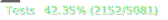

# Cytario Web

[](https://github.com/cytario/cytario-web/actions/workflows/ci.yml)

[](LICENSE)
[](https://github.com/cytario/cytario-web/releases)
[](https://nodejs.org/)
[](https://github.com/cytario/cytario-web)

A web-based file browser and viewer for scientific imaging data. Cytario Web lets you explore, visualize, and manage large-scale datasets (OME-TIFF, GeoTIFF, Parquet) stored in S3-compatible object storage.

For the hosted product, see [cytario.com](https://www.cytario.com).


## Architecture

| Layer | Technology |
|-------|------------|
| Framework | React Router v7 (SSR), React 19, Vite 6 |
| Language | TypeScript (strict mode) |
| Visualization | deck.gl, Viv, DuckDB-WASM, Apache Arrow |
| Styling | Tailwind CSS, [@cytario/design](https://github.com/cytario/cytario-design) |
| Auth | OAuth 2.0 via Keycloak, STS for S3 credentials |
| Database | PostgreSQL (Prisma ORM), Redis/Valkey (sessions) |
| Cloud | AWS SDK v3 (S3, STS), presigned URLs |
| CI/CD | GitHub Actions, semantic-release, GHCR |

## License

This project is licensed under [AGPL-3.0](LICENSE). The source code is publicly available to provide full transparency and ensure long-term access for our users, independent of Cytario as a company.

---

## Local Development

### Prerequisites

The application requires several backend services. A local cluster is provided via Podman:

```sh
cd devenv
podman kube play local-deployment.yaml
```

| Service | Port | Description |
|---------|------|-------------|
| Keycloak | 8080 | Identity provider (admin/admin) |
| MinIO | 9000, 9001 | S3-compatible object storage |
| PostgreSQL | 5433 | Application database |
| Valkey | 6379 | Session cache (Redis-compatible) |

To stop: `podman kube down devenv/local-deployment.yaml`

### Getting Started

```sh
npm install
cp .env.template .env    # Pre-configured for the Podman cluster
npm run dev
```

### Database

PostgreSQL with [Prisma ORM](https://www.prisma.io/). Connection configured via `DATABASE_URL` in `.env`.

```sh
npx prisma migrate dev --name <migration-name>   # Create + apply migration
npx prisma migrate deploy                         # Apply pending migrations
npx prisma studio                                 # Database GUI
npx prisma generate                               # Regenerate client
```

### Design System

To develop [`@cytario/design`](https://github.com/cytario/cytario-design) components locally and see changes reflected in cytario-web, run three terminals. Assumes both repos are cloned as siblings (`../cytario-design`):

```sh
# 1. Storybook (component development at localhost:6006)
cd ../cytario-design && pnpm dev

# 2. Watch-build and sync dist to cytario-web
cd ../cytario-design && pnpm build:lib --watch \
  --onSuccess "cp dist/index.js dist/index.js.map ../cytario-web/node_modules/@cytario/design/dist/"

# 3. cytario-web dev server
npm run dev
```

The `vite.config.ts` is configured to pick up changes in `node_modules/@cytario/design` (see the `optimizeDeps.exclude`, `ssr.noExternal`, and `server.watch` settings). These only affect the dev server, not production builds.

### Debugging

The app uses [Zustand](https://github.com/pmndrs/zustand) for state management with the `devtools` middleware. Install the [Redux DevTools](https://chromewebstore.google.com/detail/redux-devtools/lmhkpmbekcpmknklioeibfkpmmfibljd) browser extension to inspect store state and actions.

### Commits

[Conventional Commits](https://www.conventionalcommits.org/) enforced via [commitlint](https://commitlint.js.org/) (`feat`, `fix`, `docs`, `refactor`, `test`, `build`, `ci`, `chore`, etc.).

### Deployment

```sh
npm run build    # Outputs build/server and build/client
npm start        # Production server
```

For containerized deployments, see the `Dockerfile`. Database migrations run automatically on startup via `docker-entrypoint.sh`.

## Acknowledgements

Built on [Viv](https://github.com/hms-dbmi/viv), a library for multiscale visualization of high-resolution, highly multiplexed bioimaging data on the web, developed by the [HIDIVE Lab](https://hidivelab.org/) at Harvard Medical School.
